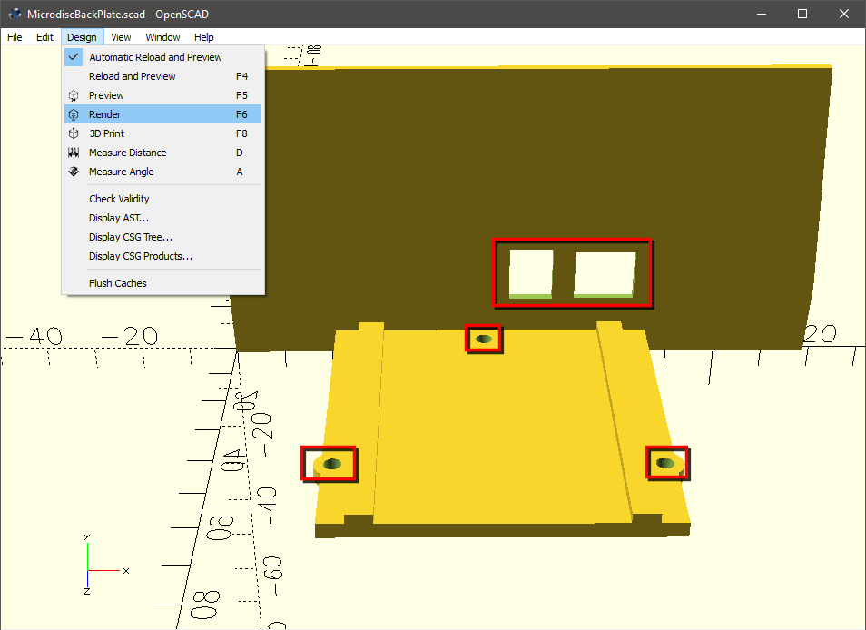

**Oric-Microdisc-Greaseweazle**

You will find here information and 3D models on how to use a Greaseweazle device with an Oric 3" Microdisc drive unit.

- [Microdisc](#microdisc)
- [Greaseweazle](#greaseweazle)
- [This project](#this-project)
- [OpenSCAD](#openscad)
  - [Render vs Preview](#render-vs-preview)
  - [Export: STL vs 3MF](#export-stl-vs-3mf)
- [Printing the object](#printing-the-object)
- [Assembling the things together](#assembling-the-things-together)

# Microdisc

The Microdisc is a peripheral for the Oric range of computers.

They exist in a number of variants such as:

* The floppy disk drive may be single sided or double sided
* The unit can contain a disk drive controller board (Master unit) or not (Slave unit)

Typically a Master unit would be used on an Oric 1 or Atmos computer (since these do not have a built-in disc controller), while a Slave unit would be used on an Oric Telestrat (which has a built-in controller) or as a generic secondary drive.

You can learn more about the Microdisc in this video.

If you wish to distribute software on floppies, you need the ability to format and write disks, either by doing it directly on the Oric using for example the INIT and BACKUP commands or some copy programs, but an alternative is to do it from a PC, which is where the Greaseweazle comes in.

# Greaseweazle

The Greaseweazle is basically a universal floppy disk controller board connected by USB.

This is not the only device of the type, see [Kryoflux](https://www.kryoflux.com) or [SuperCard Pro](https://www.cbmstuff.com/index.php?route=product/product&path=59_60&product_id=52) for example, but generally speaking most people are using the Greaseweazle so it's easier to get help on how to use it, and there are regularly new ones being made and you can build your own if you wish.

There are multiple models of Greaseweazle, most will work with all recent drives but some of the models will be problematic with older disk drives such as 3", 5.25" or 8", so since the Oric uses 3" drives you need to make sure to get a model with "Buffered Outputs".

Additionally, older drives will require a power supply that delivers both +5 and +12 voltage, and in most cases cheap "molex adapters" you find on eBay or Ali Express will simply not have enough amps to power the drive efficiently... which is why I picked-up a "Greaseweazle F7 Lightning Plus": It has a built-in 12v input that makes it easy to power older drives. (note that the "F1 plus" also has this feature according to the [Greaseweazle models page](https://github.com/keirf/greaseweazle/wiki/Greaseweazle-Models) )

Here is what the device looks like:

# This project

And here is what this project is all about.

The printed backplate...

...it does not hurt to indicate the polarity on the connector...

...and the final result with the unit connected to a PC...

So there you go, by having the Greaseweazle neatly installed inside the box you get something that does not look like some Frankenstein's monster hardware, and that also limits the problems caused by dust getting inside the case.

# OpenSCAD

You will find the STL file in the repository, but the source file is in OpenSCAD format.

OpenSCAD is a free software that allows to model objects by giving instructions like "move to this position and add a cube here that you will resize to this specific dimensions and then subtract another scaled cube from the first one to make a hole inside".

This type of system is probably not going to cut it for complex organic shapes, but for things you can mentally split in simple primitives to add or subtract to each other it's quite easy to use.

You can find OpenSCAD on https://openscad.org but unfortunately the last official release (as of today) is from January 2021 so I would recommend using one of the [Nightly Builds](https://openscad.org/downloads.html#snapshots) which have quite a few features that are unfortunately not present in the official builds!

For what's worth, I've been using "version 2025.08.19 (git 6afea6fca)" without any problem.

OpenSCAD has its own built-in editor, but it does not have support for revision control, so you can use VSCode instead with one of the plugins that allow syntax coloring and previewing directly from inside VS Code (like for example https://github.com/Antyos/vscode-openscad)

The idea is simply to load the script in OpenSCAD and you should normally see something like that:

## Render vs Preview

When you edit the script and save, the view will refresh in Preview mode.

Preview works fine for most of the high level geometry, but it does not deal very well with things that are coplanar, so for example in this object the holes will appear flickering or sometimes even not visible:

The Render mode on the other hand takes a lot longer to refresh because it performs proper geometry calculations to properly remove hidden elements, which will look like that:

This is quite important to remember, because when you want to export the object to STL to 3MF format you will have to perform a render first.

## Export: STL vs 3MF

.scad files are OpenSCAD script format, this format is not supported by most software, so you will need to export to something your printer slicer/tools of choice understand, which in most cases will be either .STL (stands for either "STereoLithography", "Standard Triangle Language" or "Standard Tessellation Language" depending of where you get the information from!) or .3MF ("3D Manufacturing Format") for the specific purpose of 3D printing.

This backplate will export just fine to .STL because it has only one material, so just go for it.

Exporting to .3MF would be mostly useful if you wanted to have multiple colors/materials, like if for example you wished to have things like the "12 volts" label actually printed out as a different color text on the plate.

If you want to export to STL, just make sure to press F6 to update the render, and then click on the STL button in the toolbar.

If you want to export to other format, then you need to go to the menu and select File -> Export

To make your life easier you'll find the [.STL](MicrodiscBackPlate.stl) file already exported alongside the [.SCAD](MicrodiscBackPlate.scad) one.

# Printing the object

You can just load/import the STL file and print it in any color you want.

You should make sure to have the back plate at the bottom of the print area so you get a nice and flat sturdy surface.

From a design point of view, having the item made of one single part means that the PCB holder is not very strong since the layers are not aligned in the proper direction, but the whole plate will rest on the bottom of the Microdisc case so in practice it should be safe.

# Assembling the things together

You will need three standard motherboard standoff and their screws:

You just need to insert the backplate in the notch in the case and then screw the Greaseweazle on it.

After that you just need to connect the floppy connector and the molex power cables and you are done.

And yes, I need proper wiring, I just used what I had laying around!
